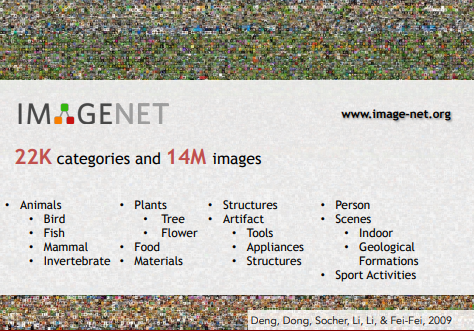

# Lecture 1: Introduction

## 1.1 Computer vison 의 중요성

+ 스마트폰에 내장되어 있는 카메라와 같이 무수한 센서의 사용으로 데이터, 특히 시각 데이터가 많아짐
+ CISCO에서 2015-2017 조사한 통계 결과 인터넷 트래픽 중 80%가 video data 이고, 이런 시각 데이터를 잘 이해하고 분석하는것이 필요
+ 시각 데이터 처리가 쉽지 않아서 "**__dark matter(암흑물질)__**" 라고도 불림(존재하는지는 알 수 있지만 직접적으로 관찰하고 의미를 도출하는것이 어려우므로)

+ conmputer vison은 interdisciplinary field의 성격을 가져 다른 science, engineering, technology 와 연관되어 해당 분야 연구에 있어서 physics, mathematics 과 같이 다른 영역의 지식에 대한 이해도 필요함 

</img>

## 1.2 Computer vison 의 역사 

    Vison(시각)의 시작과 연관지어 Computer Vision의 시작을 생각할수 있다.

+ **Biological Vision** 의 시작

  543백만년 전 동물의 종은 단순했지만, 화석을 연구하는 동물학자에 따르면 짧은 기간 동안(10만년) 생물의 종이 급증했고(evolution's Big Bang), 가장 신빙성있는 이론은 동물이 처음으로 eyes를 발달   시킨것이 원인이라는 것이다. 동물에게 있어서 Vision 이 생긴것이 능동적이고,진화적 군비경쟁(evolutionary arms race)를 촉진시켜 살아남기 위해 종의 진화를 활발하게 하였다. 이후 지능을 가진 동     물, 인간에게도 Vison은 가장 큰 감각 체계로 중요한 역할을 담당(일하고, 의사소통 등)

+ **Mechanical Vision** - computer vison의 시작
  + 르네상스 시대의 **camera obscura** : pinhole camera 이론을 바탕으로 만들어진것으로, 초창기 동물에게 있는 눈의 구조와 비슷하다. (빛을 모음->뒤쪽의 카메라에서 정보를 모으고 시상을 project함)
  + computer vision에 영향을 준 시각의 메커니즘 과정에 대한 이론은 **Hubel과 Wiesel의 전기 생리학을 이용한 연구**
  :영장류, 포유류의 "visual processing mechanism"을 찾는것으로, 인간과 비슷한 고양이를 대상으로 연구를 진행, visual processing이 단순한 구조로 시작  
  하는것을 발견( edge → pathway → brain )  
    
  </img>               
  
  
  + **BLock world** : 1963년 Larry Roberts의 시각적 세계를 단순한 기하학적 형태로 단순화 시켜 형태를 인식하고 이것이 무엇인지 재구조화 하는 연구 
  + **The summer vision project, MIT, 1966** : 시각 시스템 구조 설계 
  + **David Marr,1970s** : Hubel 과 Wisel 의 연구와 비슷하게 Biological vision처럼 처음에는 단순한 edge에서 시각 처리과정이 시작함. (이미지 입력 → 기본적인 스케치 → 2-1/2D 스케치(깊이,불연속성 등 고려) → 3-D 모델)  1970년대에는 데이터 적고, computer 속도가 느렸지만, Block 단위가 아닌 실제 세계의 물체를 인지 및 재표현 하고자 하는 노력이 이어짐
  + **Generalized Cylinder, Pictorial Structure**: 모든 물체는 단순한 primitive로 표현 가능하다는 생각을 바탕으로 복잡한 구조의 물체를 단순한 primitve의 조합으로 바꾸고 이를 기하학적으로   구성함  
  </img>            
  
  +  **David Lowe,1987** : 면도기를 선과 엣지들의 조합으로 인식함 
  
  Object recognition이 여전히 어려움 → 그래프 이론을 이용한 **Object Segmentation** (이미지 내의 픽셀들을 의미있는 영역으로서 그룹화 시킴) 을 시도함   
  
  
  </img>             

  + **Face Detection**:1999-2000년 통계학적 기계학습(ex) support vector machines,boosting, graphical models)이 등장하고 2001년 Viola & Jones가 AdaBoost alorithm을 이용하여 거의 실시간     얼굴 인식 구현 - 2006년 후지필름이 얼굴 탐지 카메라 출시 
  
  + **feature-based(1990 후반 ~ 2010년)**:  객체 탐지, 불변하는 객체의 특징을 다른 객체에 매칭(ex.SIFT, Spatial pyramid matching)     
  
     </img>      *"stop"부분의 글자는 변하지 않는 부분으로 이부분만을 매칭*        
  
  + **Pascal Visual Object challenge** : 20 object 카테고리의 데이터셋 형성
  + **ImageNet** : 시각 데이터는 기계학습 알고리즘에 train 시킬때 high demension input, parameter 수가 증가하는 상태에서 data 적으면 overfiting 문제발생함. 이를 극복하려 15만 장의 이미지, 22만가지의 카테고리 데이터셋 형성
  + **ImageNet Large scale Visual recognition challenge**  :  1,431,167 이미지를 1000개 카테고리로 분류하는 챌린지 개최 
    
     </img> 
      
     </img>                
     
      2011-2012 사이에 CNN 등장으로 급격한 error rate 감소, 이후에도 이를 tuning 한 매우 많은 layer의 NN가 계속 수상     
      
      </img>    
      
      1998년에 이미 digit을 인식하기 위하여 연구가 있었으나 무어의 법칙으로 computation이 빠른 병렬 처리가 강력한 gpu 등당과, dataset의 많은 확보로 CNN과 같이
      더 높은 capacity mdoel을 학습시키는것이 가능해짐   

## 1.3 Challenges
    행동 인식, 상황 맥락, AR,VR과 같은 새로운 분야에서의 객체 탐지는 아직 도전과제이다. 어떤 그림을 보고 어떤 상황인지 알려면 배경지식이 필요함
    이런 연구가 지속되면서 computer vision은 의료 진단, 자율주행,로보틱스 등에 효과적으로 적용될수 있고 인간의 지능을 이해하는데 도움이 될것이다.
    
